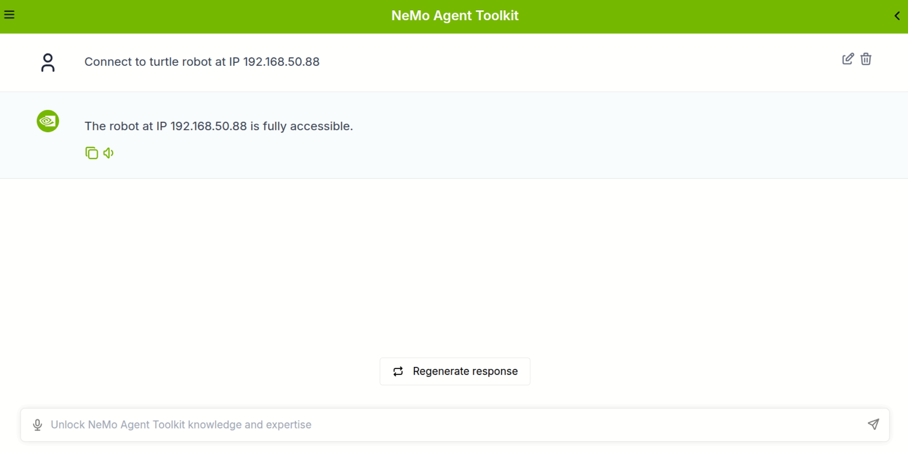

# NVIDIA NeMo Agent Toolkit MCP Client for ROS MCP Server

This document explains how to integrate the **ROS MCP Server** using the **NeMo Agent Toolkit** as an MCP client. Through this, users will learn how to configure the MCP client with their preferred model and interact with the ROS MCP Server.

✅ **Note:** This example was tested in the following environment.
- **OS**: Ubuntu 22.04 LTS
- **ROS**: Humble Hawksbill
- **Python**: 3.13 (venv)
- **NVIDIA NeMo Agent Toolkit**: release/1.3 branch


## NVIDIA NeMo & NVIDIA NeMo Agent Toolkit

[NVIDIA NeMo]((https://docs.nvidia.com/nemo-framework/user-guide/24.07/overview.html)) is a scalable, cloud-native framework for efficiently developing, customizing, and deploying generative AI models across LLM, multimodal, speech, and vision domains, and the [NVIDIA NeMo Agent Toolkit](https://developer.nvidia.com/nemo-agent-toolkit) builds on this by providing a flexible, lightweight, and unified library that easily connects enterprise agents to data sources and tools across various frameworks.

## Prerequisites
Before you begin, ensure that the following prerequisites are met:
- **ROS2 Humble**: [Install ROS2 Humble](https://docs.ros.org/en/humble/Installation.html)

## Quick Start
## 1. Install NVIDIA NeMo Agent Toolkit

The `main branch` of the NVIDIA NeMo Agent Toolkit currently supports only the SSE transport method for communication between the MCP Client and MCP Server.
The ROS MCP Server, on the other hand, currently supports STDIO, HTTP, and Streamable HTTP transports, with SSE support planned for a future release.

Therefore, this example uses the `release/1.3 branch` of the NVIDIA NeMo Agent Toolkit, which supports all transport types, instead of the main branch.

For detailed installation instructions for this branch, refer to the [NVIDIA NeMo Agent Toolkit Installation Guide](https://github.com/NVIDIA/NeMo-Agent-Toolkit/blob/release/1.3/docs/source/quick-start/installing.md).
A summary of the guide is provided below.


### 1) Clone the NeMo Agent toolkit repository to your local machine.
```bash
git clone -b release/1.3 https://github.com/NVIDIA/NeMo-Agent-Toolkit.git nemo-agent-toolkit
cd nemo-agent-toolkit
```

### 2) Initialize, fetch, and update submodules in the Git repository.
```bash
git submodule update --init --recursive
```

### 3) Fetch the data sets by downloading the LFS files.
```bash
git lfs install
git lfs fetch
git lfs pull
``` 

### 4) Create a Python environment.
```bash
uv venv --python 3.13 --seed .venv
source .venv/bin/activate
```

### 5) Install the NeMo Agent toolkit library. To install the NeMo Agent toolkit library along with all of the optional dependencies. Including developer tools (--all-groups) and all of the dependencies needed for profiling and plugins (--all-extras) in the source repository, run the following:

```bash
uv sync --all-groups --all-extras
```
###  Alternatively to install just the core NeMo Agent toolkit without any optional plugins, run the following:
```bash
uv sync
```

### 6. Verify that you've installed the NeMo Agent toolkit library.
```bash
nat --help
nat --version
```
If the installation succeeded, the nat command will log the help message and its current version.


## 2. Obtaining API Keys
### Obtaining API Keys
Depending on which workflows you are running, you may need to obtain API keys from the respective services. Most NeMo Agent toolkit workflows require an NVIDIA API key defined with the `NVIDIA_API_KEY` environment variable. An API key can be obtained by visiting [`build.nvidia.com`](https://build.nvidia.com/) and creating an account.

### Running Example Workflows

Before running any of the NeMo Agent toolkit examples, set your NVIDIA API key as an
environment variable to access NVIDIA AI services.

```bash
export NVIDIA_API_KEY=<YOUR_API_KEY>
```

:::{note}
Replace `<YOUR_API_KEY>` with your actual NVIDIA API key.
:::


## 3. Test the NeMo Agent Toolkit Installation using an Example Workflow

To verify that the NeMo Agent Toolkit has been installed correctly, the following example workflow will be executed. This example is excerpted from the [NeMo Agent Toolkit as an MCP Client](https://github.com/NVIDIA/NeMo-Agent-Toolkit/blob/release/1.3/docs/source/workflows/mcp/mcp-client.md) documentation.

### 1) Start the remote MCP server:
```bash
nat mcp serve --config_file examples/getting_started/simple_calculator/configs/config.yml
```
This starts an MCP server on port 9901 with endpoint /mcp and uses streamable-http transport. See the MCP Server documentation for more information.

### 2) Run the workflow
```bash
nat run --config_file examples/MCP/simple_calculator_mcp/configs/config-mcp-client.yml --input "Is the product of 2 * 4 greater than the current hour of the day?"
```
This command connects to the MCP Server, asks the question, "Is the product of 2 * 4 greater than the current hour of the day?", and outputs the response. If a response is returned, it indicates that the NeMo Agent Toolkit is installed correctly and communication with the MCP Server is successful.


## 4. Install NVIDIA NeMo Agent Toolkit API Server and User Interface

NVIDIA NeMo Agent toolkit provides a user interface for interacting with your running workflow. This guide walks you through starting the API server and launching the web-based user interface to interact with your workflows.

Install the NeMo Agent Toolkit API server and user interface by following the [installation guide](https://github.com/NVIDIA/NeMo-Agent-Toolkit/blob/release/1.3/docs/source/quick-start/launching-ui.md).


## 5. Integrate NeMo Agent Toolkit with ROS MCP Server
To integrate the ROS MCP Server using the NeMo Agent Toolkit as an MCP Client, the MCP Client configuration of the NeMo Agent Toolkit must be adjusted to match the ROS MCP Server. The following steps outline how to do this.

### 1) MCP Client Configuration

NeMo Agent toolkit enables workflows to use MCP tools as functions. The library handles the MCP server connection, tool discovery, and function registration. This allows the workflow to use MCP tools as regular functions.

Tools served by remote MCP servers can be leveraged as NeMo Agent toolkit functions in one of two ways:

- `mcp_client`: A flexible configuration using function groups, that allows you to connect to a MCP server, dynamically discover the tools it serves, and register them as NeMo Agent toolkit functions.
- `mcp_tool_wrapper`: A simple configuration that allows you wrap a single MCP tool as a NeMo Agent toolkit function.

In this example, the `mcp_client` configuration is used to connect to the ROS MCP Server, dynamically discover the available tools, and register them as NeMo Agent Toolkit functions.

The MCP Client configuration file for this example is located at `robot-mcp-client/clients/nvidia_nemo/configs/config-mcp-client.yml`. Open this file and modify the following parameters.


```yaml
function_groups:
  ros_mcp_tools:
    _type: mcp_client
    server:
      transport: stdio
      command: "uv"
      args: ["--directory", "/<ABSOLUTE_PATH>/ros-mcp-server", "run", "server.py"]
llms:
  nim_llm:
    _type: nim
    model_name: meta/llama-4-maverick-17b-128e-instruct
    temperature: 0.0
    max_tokens: 1024

workflow:
  _type: react_agent
  tool_names:
    - ros_mcp_tools
  llm_name: nim_llm
  verbose: true
  retry_parsing_errors: true
  max_retries: 3
```

- `args`: Replace `<ABSOLUTE_PATH>` with the absolute path to the `ros-mcp-server` directory on your system.
- `model_name`: You can change the model to any other model available in [NVIDIA NeMo](https://build.nvidia.com/models)

In addition, additional parameters can be adjusted by referring to the [NeMo Agent Toolkit as an MCP Client](https://github.com/NVIDIA/NeMo-Agent-Toolkit/blob/release/1.3/docs/source/workflows/mcp/mcp-client.md) documentation.

### 2) Modify NVIDIA Agent Toolkit MCP Scripts for ROS MCP Server
Currently, there are parts of the NeMo Agent Toolkit's MCP functionality that are not compatible with the ROS MCP Server, so the script needs to be modified to ensure compatibility. There are a total of two such areas, as outlined below.

⚠️ **Caution**
* It is recommended to back up the original file before making any modifications.
* If the NeMo Agent Toolkit is updated, the file may need to be modified again.

### 1. `nemo-agent-toolkit/packages/nvidia_nat_mcp/src/nat/plugins/mcp/utils.py`

The reason for modifying this code is that ROS MCP Server can pass arrays of objects with undefined structure. To handle this safely, the code was updated to properly process object type arrays without properties in MCP schemas, preventing runtime errors.

A modified version of this script is provided at `robot-mcp-client/clients/nvidia_nemo/scripts/utils.py`. Replace the original script with the modified version using the following command:

```bash
cp robot-mcp-client/clients/nvidia_nemo/scripts/utils.py nemo-agent-toolkit/packages/nvidia_nat_mcp/src/nat/plugins/mcp/utils.py
```

### 2. `nemo-agent-toolkit/packages/nvidia_nat_mcp/src/nat/plugins/mcp/client_base.py`

The reason for modifying the script is that the current MCP Client of the NeMo Agent Toolkit can only handle TextContent-type responses from the MCP Server. However, the ROS MCP Server provides tools that return images via ImageContent, so the script needs to be updated to handle ImageContent-type responses as well.

A modified version of this script is provided at `robot-mcp-client/clients/nvidia_nemo/scripts/client_base.py`. Replace the original script with the modified version using the following command:

```bash
cp robot-mcp-client/clients/nvidia_nemo/scripts/client_base.py nemo-agent-toolkit/packages/nvidia_nat_mcp/src/nat/plugins/mcp/client_base.py
```


## 6. Run the ROS MCP Server with NeMo Agent Toolkit

Once all installations and modifications are complete, the ROS MCP Server can be run with the NeMo Agent Toolkit by following the steps below.


### Start the ROS MCP Server using NeMo Agent Toolkit

```bash
cd nemo-agent-toolkit
source .venv/bin/activate
nat serve --config_file /<ABSOLUTE_PATH>/robot-mcp-client/clients/nvidia_nemo/configs/config-mcp-client.yml
```
This command starts the ROS MCP Server using the NeMo Agent Toolkit. The ROS MCP Server runs the `server.py` script in the `ros-mcp-server` directory using the STDIO transport method.


## 7. Test the Integration of NeMo Agent Toolkit with ROS MCP Server

### 1) Launch the NeMo Agent Toolkit User Interface

In a new terminal, launch the NeMo Agent Toolkit user interface by following the steps below.
```bash
cd nemo-agent-toolkit
source .venv/bin/activate
cd external/nat-ui
npm run dev
```
This command starts the NeMo Agent Toolkit user interface, which can be accessed at `http://localhost:3000` in a web browser.

### 2) Launch Turtlesim Node & Launch Rosbridge

In this example, the `turtlesim` package is used for a simple test. Open a new terminal and run the following command to start the `turtlesim_node`.

```bash
source /opt/ros/humble/setup.bash
ros2 run turtlesim turtlesim_node
```

In another terminal, launch `rosbridge` to enable communication between the NeMo Agent Toolkit and ROS.

```bash
source /opt/ros/humble/setup.bash
ros2 launch rosbridge_server rosbridge_websocket_launch.xml
```

### 3) Simple Test using NeMo Agent Toolkit User Interface

Open a web browser and navigate to `http://localhost:3000`. You should see the NeMo Agent Toolkit user interface.
First, enter the following command to connect to the turtlesim robot.

```bash
Connect to turtle robot at IP <IP_ADDRESS>
```
Replace `<IP_ADDRESS>` with the actual IP address of your machine running the `turtlesim_node`.

If the connection is successful, you should see a message similar to the one in the image below.



Next, enter the following command to move the turtle robot.

```bash
Move the turtle robot forward for 5 seconds.
```

If the command is executed successfully, the turtle robot should move forward for 5 seconds, as shown in the image below.


## Advanced Usage
### Customizing the Model
You can customize the model used by the NeMo Agent Toolkit by changing the `model_name` parameter in the MCP Client configuration file (`config-mcp-client.yml`). For example, to use a different model, simply replace the existing model name with your desired model name.

### Using Different Transport Methods
The NeMo Agent Toolkit supports various transport methods for communication with the MCP Server. You can change the `transport` parameter in the MCP Client configuration file to use a different transport method, such as `http` or `streamable-http`. Make sure that the ROS MCP Server is configured to support the chosen transport method.

### Using Different Simulated or Real Robots
You can use other simulated or real robots that are compatible with ROS. Ensure that the robot is running and that the necessary topics and services are available for interaction. If the robot is running and Rosbridge is active, the NeMo Agent Toolkit can interact with it using natural language commands.